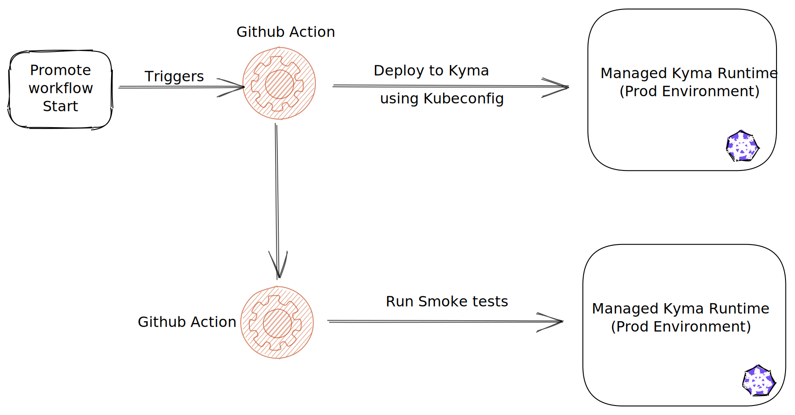
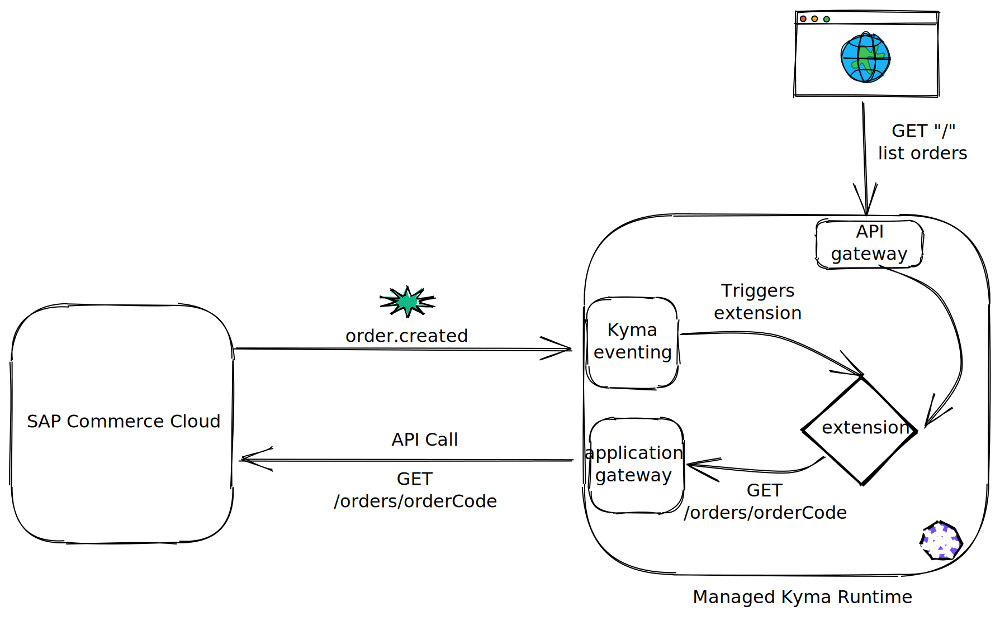

# Overview

With more & more developers building extensions and applications using Managed Kyma runtime, it is but natural to implement CI-CD flows.

As a developer, I would like to ensure,

- Code quality of my Kyma funtions and microservcies
- All checks related to code styling, security best practices are followed
- Sufficient code covergae to have confidence in the production deployments
- Fewer surprises and fewer breaking changes

I would like to have **seamless automated deployments**

- Creation of assets such as docker images
- Functions & microservices are automatically deployed to my desired Kyma environment and namespace.
- All necessary configurations are also applied
- My Source control (e.g Git) to be source of truth for all my deployments.

Below is a sample flow using Github actions (which can be easily replaced by any other similiar service such as Jenkins)

## Developer CI CD Flow


The initial part is a standard PR flow where certain checks are performed for a PR to ensure it can be safely merged to main branch.

Post merge, the assets (in this case docker images) are created for microservices and pushed to docker registry.

Functions are configured using [Kyma GitRepository feature](https://kyma-project.io/docs/components/serverless/#tutorials-create-a-function-from-git-repository-sources) which automatically pulls the source code and updates the running function.

### Deploying to Dev

Deployment resources are defined as [Helm-charts](https://helm.sh/) which are available under [k8s-resources](./k8s-resources/README.md)

Deployment to a dev landscape is done via the github worklow [deploy-to-dev](.github/workflows/deploy-to-dev.yml)

Any dev landscape specific configuration is provided in the [values-dev.yaml](k8s-resources/values-dev.yaml).

For any confidential data, it is possible to create secrets and use environment variables with github workflow.

The not-expiring Kubeconfigs are obtained following the instructions [kubeconfig-for-sa](https://github.com/kyma-incubator/examples/tree/master/kubeconfig-for-sa)

Below are the steps in **deploy-to-dev** worklow.

It uses various actions from Microsoft azure to set up the Kubernetes environment such as:

- Setting the K8S context
- Setting up Helm

The `KUBECONFIG` is configured safely as a environment secret in the repository settings.

```yaml
jobs:
  # This workflow contains a single job called "build"
  deploy-to-dev:
    # The type of runner that the job will run on
    runs-on: ubuntu-latest
    # Steps represent a sequence of tasks that will be executed as part of the job
    steps:
      # Checks-out your repository under $GITHUB_WORKSPACE, so your job can access it
      - uses: actions/checkout@v2
      - uses: azure/k8s-set-context@v1
        with:
          method: kubeconfig
          kubeconfig: ${{ secrets.DEV_KUBECONFIG }}
      - uses: azure/setup-helm@v1
        with:
          version: 'v3.5.1'
      - name: Helm Deployment
        working-directory: k8s-resources
        run: helm upgrade k8s-resources . -f ./values-dev.yaml --install
      - name: Run smoke tests on dev environment
        run: echo "running smoke tests"
```

The worklow will deploy the workloads as well all the necessary configurations such as:

- API Rules
- ServiceBindingUsage
- K8s Deployments, Services
- and any other required resources.

The only exception is to create the Service Instances for required servcies and events. For Services, Secrets are also required to be created. In the future releases, these manuals steps will also be obviated.


The corresponding details then need to (secret name and gateway url variable name), then needs to configured in [values-dev.yaml](k8s-resources/values-dev.yaml) & [values-prod.yaml](k8s-resources/values-prod.yaml) for dev and prod landscapes respectively.

## Promote to production



The workflow to promote to production is very similar to the one used for deploying to dev landscape.
The only differences are it uses a different kubeconfig and [values-prod.yaml](k8s-resources/values-prod.yaml) for helm installation.

## Deployed Extension



## Deployed Functions

